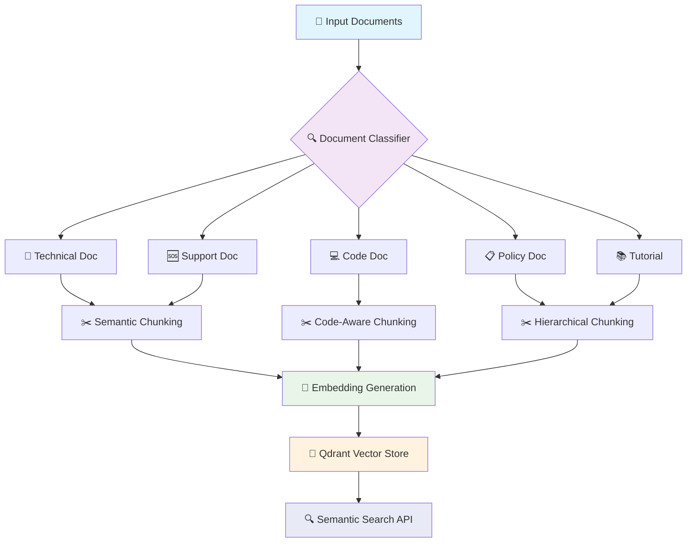
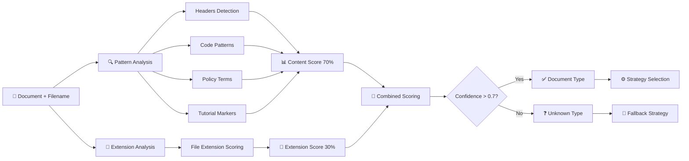
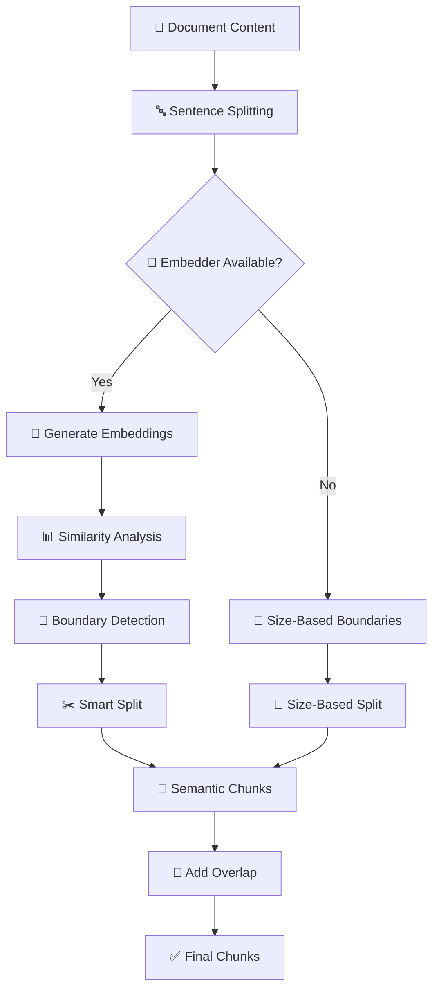
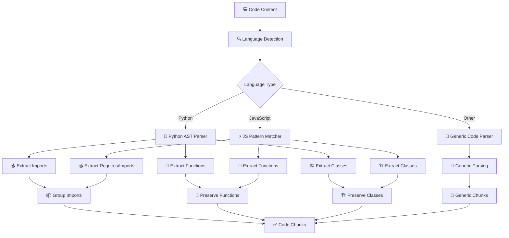
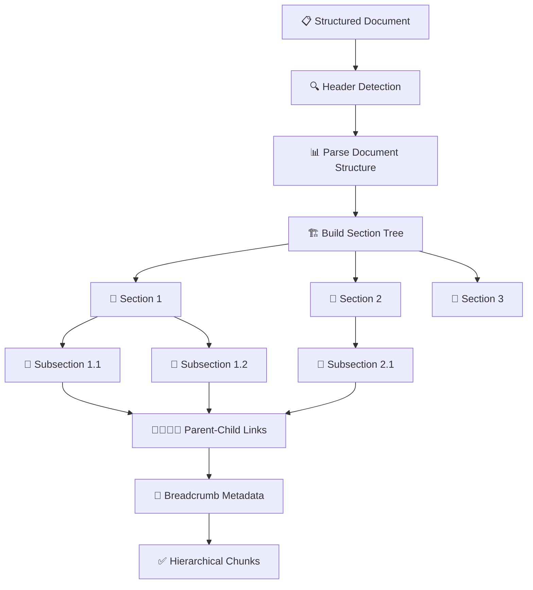
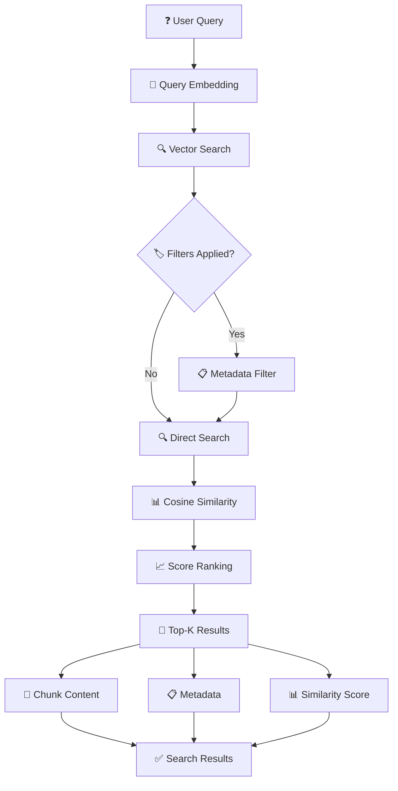
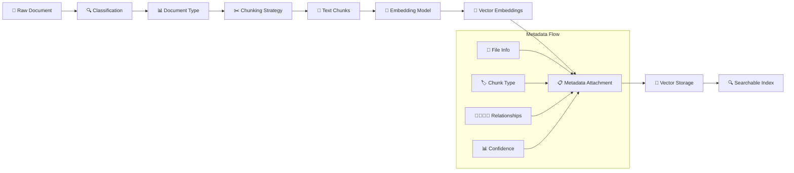
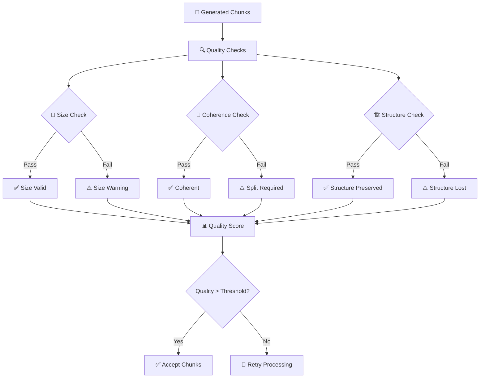
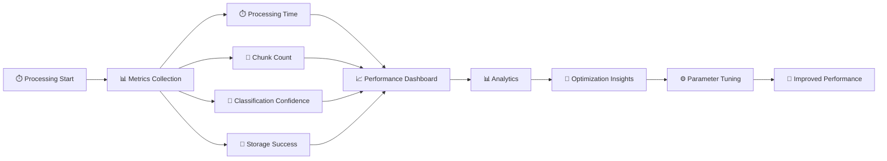
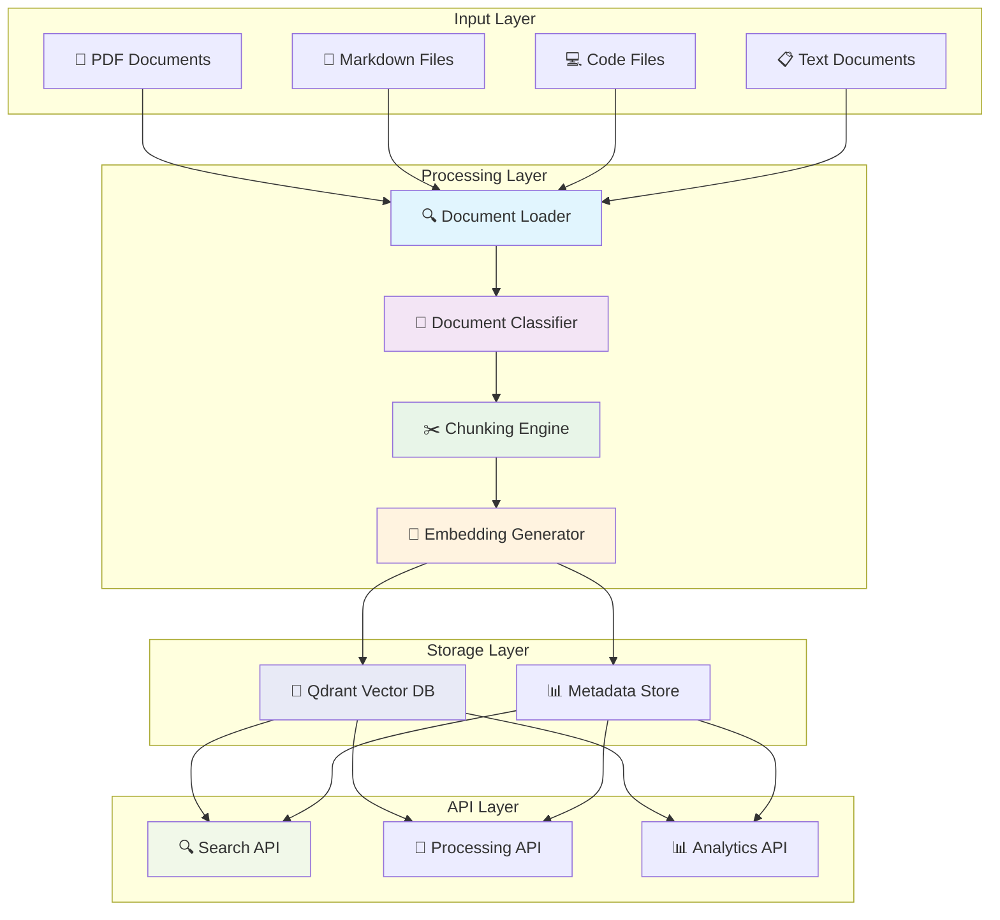

# 🔄 Enterprise Document Chunking - System Flow

## 📊 High-Level System Flow

## 🔍 Document Classification Flow

## ✂️ Chunking Strategy Details

### Semantic Chunking Flow

### Code-Aware Chunking Flow

### Hierarchical Chunking Flow

## 🧠 Embedding & Storage Pipeline

## 🔍 Search & Retrieval Flow

## 📊 Data Transformation Pipeline

## 🎯 Quality Control Flow

## 📈 Performance Monitoring Flow

## 🔄 Complete System Integration

---

## 📋 Processing Steps Summary

1. **📄 Document Input**: Multi-format document ingestion
2. **🔍 Classification**: Pattern-based document type detection
3. **⚙️ Strategy Selection**: Mapping document type to chunking strategy
4. **✂️ Adaptive Chunking**: Content-aware chunk generation
5. **🧠 Embedding**: Vector representation generation
6. **💾 Storage**: Persistent vector storage with metadata
7. **🔍 Search**: Semantic similarity search and ranking
8. **📊 Analytics**: Performance monitoring and optimization

Each step is designed to preserve document structure and semantic meaning while optimizing for retrieval accuracy in enterprise knowledge management scenarios. 