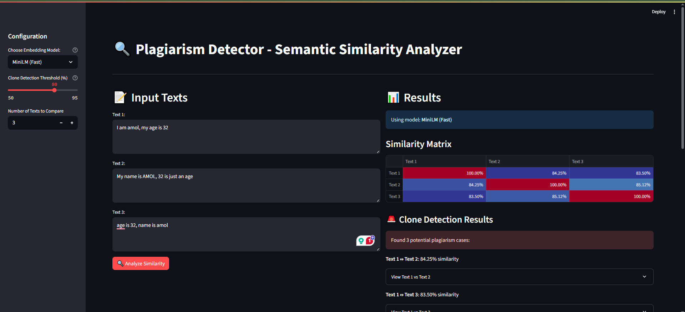

# Plagiarism Detector - Semantic Similarity Analyzer

## 🖼️ Application Output



*The application provides an intuitive interface for analyzing text similarity with multiple embedding models and visual results.*

## Quick Setup (Using UV - Recommended)

```bash
# Install UV (if not already installed)
curl -Ls https://astral.sh/uv/install.sh | sh

# Create project directory
mkdir plagiarism-detector
cd plagiarism-detector

# Add dependencies
uv add streamlit sentence-transformers scikit-learn plotly pandas numpy matplotlib

# Save the main.py file and run
uv run streamlit run main.py

or

uv run --isolated streamlit run app.py
```

## Alternative Setup (Traditional pip)

```bash
# Create virtual environment
python -m venv venv
source venv/bin/activate  # On Windows: venv\Scripts\activate

# Install dependencies
pip install streamlit sentence-transformers scikit-learn plotly pandas numpy matplotlib langchain openai python-dotenv

# Run the app
streamlit run app.py
```

## Dependencies Explained

- **streamlit**: Web interface framework
- **sentence-transformers**: Pre-trained embedding models
- **scikit-learn**: Cosine similarity calculation
- **plotly**: Interactive visualizations
- **pandas**: Data manipulation
- **numpy**: Numerical operations
- **matplotlib**: Additional plotting capabilities

## Usage

1. Run the app: `uv run streamlit run app.py`
2. Open browser at `http://localhost:8501`
3. Configure settings in the sidebar:
   - Choose embedding model
   - Set clone detection threshold
   - Select number of texts to compare
4. Enter texts in the input boxes
5. Click "Analyze Similarity"
6. View results including:
   - Similarity matrix
   - Clone detection results
   - Model comparison

## Features

✅ Dynamic text input boxes
✅ Multiple embedding models (MiniLM, MPNet)
✅ Similarity matrix visualization
✅ Clone detection with configurable thresholds
✅ Interactive results display
✅ Model comparison functionality
✅ Built-in documentation
✅ Expandable text comparison view

## Project Structure

```
Plagiarism Detector - Semantic Similarity Analyzer/
├── app.py              # Main Streamlit application
├── engine/
│   ├── detection.py    # Clone detection logic
│   ├── embeddings.py   # Embedding model loading
│   └── similarity.py   # Similarity calculation
├── utils/
│   └── visualization.py # Data visualization utilities
├── pyproject.toml      # Project dependencies and configuration
├── uv.lock            # Lock file for reproducible builds
├── README.md          # This documentation
└── test_cases.md      # Test cases and examples
```

## Adding OpenAI Embeddings (Optional)

If you want to add OpenAI embeddings:

```bash
uv add openai  # or pip install openai
```

Then add to the code:

```python
# Add to load_models function
'OpenAI Ada': OpenAIEmbeddings(model="text-embedding-ada-002")
```

## Project Structure (Simplified)

```
plagiarism-detector/
├── app.py           # Complete application
├── README.md        # This file
└── pyproject.toml   # Auto-generated by UV
```

## Technical Details

- Uses semantic similarity detection rather than simple keyword matching
- Embeddings capture semantic meaning, enabling detection of paraphrasing
- Configurable similarity thresholds for different use cases
- Supports multiple embedding models for comparison
- Built with modern Python libraries for optimal performance