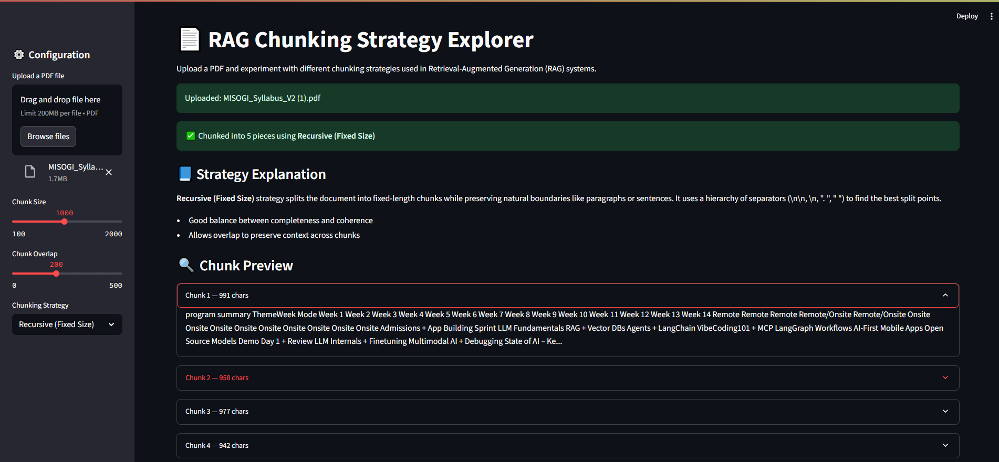

# 📄 RAG Chunking Explorer

## 🖼️ Application Output



An interactive Streamlit app to **experiment with chunking strategies** for documents before sending them through a Retrieval-Augmented Generation (RAG) pipeline. Supports chunk previews, metadata, and embeddings storage via Qdrant using Gemini embeddings.

---

## 🚀 Features

* 📂 Upload PDFs and extract full text
* ✂️ Choose between **Recursive** and **Markdown-aware** chunking strategies
* 🧠 Visualize chunk sizes, overlaps, and raw content
* 📌 Understand how each strategy works and when to use it
* 🔗 Store chunk embeddings in **Qdrant** vector database (optional)
* 🤖 Powered by **LangChain** + **Gemini Embeddings**

---

## 🗂️ Folder Structure

```
rag_chunking_strategies/
├── app.py                     # Main Streamlit application
├── docker-compose.db.yml      # Launch Qdrant locally via Docker
│
├── engine/
│   └── load_and_split.py      # PDF loading and chunking logic
│
├── rag/
│   └── embed_store.py         # Embedding + Qdrant vector DB logic
│
├── utils/
│   └── explain.py             # Strategy explanation content (markdown/text)
│
├── .python-version
└── pyproject.toml             # Managed by uv (dependency manager)
```

---

## ⚙️ Requirements

> We use [`uv`](https://github.com/astral-sh/uv) for fast dependency management. No need for manual virtualenv activation.

---

## 📋 **Prerequisites**

* Python 3.8+
* Docker & Docker Compose
* Google Gemini API Key
* [`uv`](https://github.com/astral-sh/uv) installed globally

To install `uv`:

```bash
curl -Ls https://astral.sh/uv/install.sh | sh
```

---

## 🚀 **Quick Start**

### 1. **Clone and Setup**

```bash
git clone <repository-url>
cd rag_chunking_strategies
uv venv
uv add streamlit langchain langchain-community langchain-text-splitters langchain-google-genai langchain-qdrant python-dotenv pypdf nltk scikit-learn
```

Open a Python shell or a new cell in your code and run:
```bash
import nltk
nltk.download('punkt')
```

### 2. **Environment Setup**

Create a `.env` file in the project root:

```env
GEMINI_API_KEY=your_google_gemini_api_key_here
```

### 3. **Run the Streamlit App**

```bash
uv run streamlit run app.py
```

---

## 📘 Supported Chunking Strategies

| Strategy           | Description                                                                                       |
| ------------------ | ------------------------------------------------------------------------------------------------- |
| **Recursive**      | Default LangChain splitter that breaks text respecting structure (paragraphs → lines → sentences) |
| **Markdown-aware** | Preserves headers and sections when chunking structured Markdown or educational docs              |

---

## 📬 Output Preview

* Displays up to 5 chunks with content and metadata
* Chunk counts and sizes
* Optional Qdrant ingestion with embeddings

---

## 🧠 Why This Matters

Chunking is **critical to RAG performance**. This app helps you visualize and compare strategies before integrating into your real LLM workflows.

---
