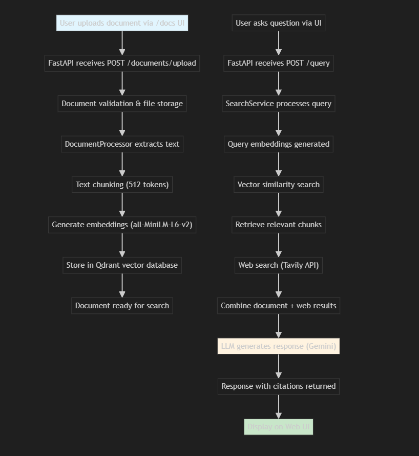

# 🚀 Research Assistant - Hybrid RAG System

**AI-Powered Document Analysis + Real-Time Web Search**

Transform your documents into an intelligent knowledge base! Upload PDFs, ask questions, and get AI-powered answers with real-time web search integration.

## 🎯 What You Can Do

✅ **Upload Documents** - PDF, TXT, DOCX files  
✅ **Ask Questions** - Get AI-powered answers from your documents  
✅ **Web Search Integration** - Real-time web search for latest information  
✅ **Smart Citations** - See exactly where answers come from  
✅ **Hybrid Search** - Combines document knowledge + live web data  

## ⚡ Quick Start (2 Minutes Setup!)

### 1️⃣ **Get API Keys** (Free!)
- 🔑 **Gemini API**: Get free key at [Google AI Studio](https://makersuite.google.com/app/apikey)
- 🌐 **Tavily API**: Get free key at [Tavily.com](https://tavily.com/)

### 2️⃣ **Install & Run**
```bash
# Clone the project
git clone <your-repo-url>
cd research-analyst

# Install everything (one command!)
uv sync

# Create your .env file
echo "GEMINI_API_KEY=your_gemini_key_here" > .env
echo "TAVILY_API_KEY=your_tavily_key_here" >> .env

# Start the app (it handles everything automatically!)
python main.py
```

### 3️⃣ **Start Using!**
🌐 **Open**: http://localhost:8000/docs  
📁 **Upload**: Your PDF/TXT documents  
💬 **Ask**: Questions about your documents  
🚀 **Get**: AI-powered answers with citations!  

## 🎯 Simple Usage Example

1. **Upload a Document**: 
   - Go to http://localhost:8000/docs
   - Try `POST /documents/upload`
   - Upload your PDF file

2. **Ask Questions**:
   - Try `POST /query` 
   - Ask: *"What are the main points in my document?"*
   - Get instant AI answers with sources!

## 💪 Advanced Features

- **🔄 Real-time Web Search**: Get latest information beyond your documents
- **🧠 Smart Chunking**: Optimized text processing for better answers
- **📊 Health Monitoring**: Check system status at `/health`
- **🔍 Hybrid Search**: Document + Web results combined intelligently

## 🛠️ Tech Stack

- **🤖 AI**: Google Gemini 2.0 Flash + LangChain
- **🔍 Search**: Tavily API for real-time web search  
- **📊 Vector DB**: Qdrant (auto-fallback to in-memory)
- **⚡ Backend**: FastAPI with async processing
- **📝 Embeddings**: all-MiniLM-L6-v2 (384d, fast & accurate)

## 🔧 Troubleshooting

**App won't start?**
- Make sure you have Python 3.12+
- Check your API keys in `.env` file
- Run `uv sync` to install dependencies

**No documents showing up?**
- Check the `/health` endpoint for system status
- Documents are processed automatically after upload

**Questions not working?**
- Verify your Gemini API key is valid
- Check if documents are processed (status in response)

## 📖 Learn More

- **API Docs**: http://localhost:8000/docs (interactive!)
- **System Health**: http://localhost:8000/health
- **Built with**: [LangChain](https://langchain.com) + [FastAPI](https://fastapi.tiangolo.com)

---

**🎉 Ready to transform your documents into an AI assistant? Get started in 2 minutes!**
